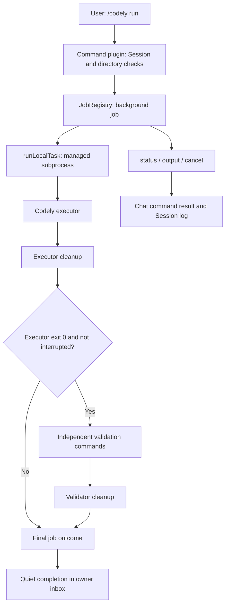

# MGSD L1: local DSH implementation summary

English | [中文](MGSD_L1_Local_DSH_Implementation_Summary.zh.md)

## Summary

L1 lets a user start a local Codely task from DSH, inspect its output, cancel it, and accept its result through separately configured checks. Codely performs the coding work. DSH manages execution, process cleanup, job status, and presentation. L1 acceptance is complete; local task persistence and the deterministic MGSD workflow continue in L2. This reference summarizes the implementation and its observed limits as of 2026-10-07. The [implementation checklist](MGSD_Implementation_Checklist.md) owns milestone status; the [local user guide](user/guide/codely-local.md) owns setup and operating instructions.

## Table of Contents

- [Goals and delivered scope](#scope)
- [Responsibilities and execution flow](#execution)
- [Implementation](#implementation)
- [Configuration](#configuration)
- [Outcomes and acceptance rules](#outcomes)
- [Acceptance coverage](#acceptance)
- [Implementation files](#files)
- [Limits and L2 handoff](#handoff)
- [Dev Note: recorded verification](#evidence)

## Goals and delivered scope

The local-first plan starts with a usable, verifiable Codely integration on one machine. L1 completes acceptance of that prototype before introducing the broader MGSD task workflow or remote dispatch.

| Delivered capability | User-visible result |
|---|---|
| Local task submission | `/codely run <task>` starts a background job in the Session's selected project directory and returns a job id. |
| Progress inspection | `/codely status` lists this Session's Codely jobs; `/codely output <id>` returns retained output and identifies discarded earlier output. |
| Independent acceptance | Executor success must be followed by success from every configured check before the job becomes `completed`. |
| Cancellation and deadlines | `/codely cancel <id>`, the overall deadline, and plugin unload stop managed work and wait for cleanup. |
| Session access and directory admission | A Session can control only its own Codely jobs; this plugin instance permits one active Codely job per real directory. |
| Browser operation | Commands and results appear in Chat without a preceding model turn; displayed command records remain visible after reload. |
| Repeatable acceptance | Deterministic lifecycle checks, actual Loader/process checks, a live Codely smoke, and keyless Web/Session replay provide complementary evidence. |

## Responsibilities and execution flow

Codely owns its coding agent loop. DSH uses its existing human-command, Jobs, and Subprocess services to run that loop as external work. The integration is an opt-in Cordis overlay; it does not require changes to the DSH agent loop.

| Actor | Responsibility |
|---|---|
| User | Select the local project, submit the task, configure trusted acceptance commands, and inspect results. |
| Codely | Execute the prompt and modify the selected project using its own model and tools. |
| Local command plugin | Validate configuration, authorize access by Session, enforce directory admission, and create/cancel jobs. |
| DSH Jobs and Subprocess | Retain bounded output and job status, start managed processes, and handle cancellation and teardown. |
| Independent checks | Decide acceptance using executable commands run separately from Codely's process. |
| DSH Chat and Session log | Present command results and persist command invocations/results through the existing Session event mechanism. |

`/codely` execution and job completion do not open a DSH model turn. Each job requests quiet delivery, and its completion notice remains pending in its owner's inbox. Ordinary chat still uses the selected DSH model and may consume pending notices. Real Codely execution can call Codely's own model; a zero DSH model-call count does not mean that no model ran.

## Implementation

The implementation reuses existing DSH services and keeps the local adapter small. Package READMEs and the source files below own the exact service APIs.

### Command plugin and project ownership

The overlay loads `plugin.mjs`, which requires `commands`, `jobs`, and `subprocess`. Plugin activation rejects missing or empty executable configuration, an empty check list, NUL bytes in argv, shell-shim executables ending in `.cmd`, `.bat`, or `.ps1`, and invalid numeric bounds. On Windows, Codely launches through `node.exe` plus its installed JavaScript entry.

The plugin reads the project from `agent.session.header.cwd` and requires an existing absolute directory. It resolves the real path and uses a case-normalized key on Windows to reject a second active job in the same directory. Jobs carry the current Session owner, and status/output/cancel select only that owner's Codely jobs. The admission map is local to one plugin instance; it is not a cross-process lock.

### Executor, validation, and cleanup

`run.mjs` sends executable argv directly to `ctx.subprocess.spawn`, without implicit shell parsing. Codely receives `--no-upm`, `--approval-mode=auto_edit`, `--path-policy=strict`, `--output-format=stream-json`, and the complete prompt as one `--prompt=<task>` argument. This preserves Unicode and multiline prompts without routing them through a shell shim.

One cancellation signal and deadline cover the executor and all validation commands. The runner collects stdout/stderr into bounded buffers, drains them into job output, records observed exit codes/signals, and terminates and waits for the managed process range at each process's end. It drains available output before writing the exit record so the record follows the output it describes.

After successful executor cleanup, the runner checks interruption before starting validation. It runs checks sequentially and stops at the first failure or interruption. Cancellation or a deadline during final-validator cleanup cannot become success. A failed cleanup produces `failed`, including when cancellation or timeout also occurred. Plugin unload aborts its active jobs and awaits their runner completion.

### Quiet completion and Chat presentation

`JobSpec` and settled `JobEvent` support an optional `completionDelivery: 'quiet'`. `jobs-local` carries this requirement to settlement; `tool-jobs` still queues the completion notice but does not wake an idle owner for that job. Other producers retain the controller's configured delivery behavior. This makes Codely completion quiet even when the selected preset uses wakeup delivery for other jobs.

The Chat snapshot builder activates a conversation when its filtered snapshot contains visible rows. Consequently, a command-only conversation displays its command results before any model turn; hidden permission commands alone still do not activate Chat. The browser scenario checks that recorded Codely command rows remain visible after reload.

## Configuration

The [local user guide](user/guide/codely-local.md#configure) gives the tested configuration and Web launch entry. The overlay reads JSON argv arrays from environment variables, while numeric limits are Cordis plugin configuration fields.

| Setting | Meaning | Default or requirement |
|---|---|---|
| `DSH_CODELY_COMMAND` → `command` | Executable and launch arguments for Codely. | Required, non-empty JSON argv array. |
| `DSH_CODELY_CHECKS` → `checks` | Independently executed acceptance commands. | Required, JSON array containing at least one non-empty argv array. |
| `timeoutMs` | Overall executor/check deadline. | `900000` ms (15 minutes). |
| `graceMs` | Grace period passed to the managed subprocess provider. | `3000` ms. |
| `maxBytes` | Collection bound supplied separately to stdout and stderr. | `65536` bytes per stream. |
| `pollMs` | Interval for draining process output into the job. | `100` ms. |

Numeric fields must be positive safe integers no greater than `2147483647`. Checks run with the same project cwd as the executor. A check script the coding agent can rewrite is not independent evidence of the acceptance criteria; configure checks whose implementation or expected results remain trusted.

## Outcomes and acceptance rules

The job reports a process outcome after cleanup. Its detail and retained output distinguish executor failure, validation failure, interruption, and cleanup failure.

| Condition | Final status | Acceptance meaning |
|---|---|---|
| Codely exits 0, all checks exit 0, cleanup succeeds, and no interruption occurs. | `completed` | The configured executable checks passed; this alone does not establish semantic correctness. |
| Codely exits nonzero. | `failed` | Validation is not run. |
| A check exits nonzero. | `failed` | Its index, exit code, and signal are reported; later checks are not run. |
| Cancellation or deadline interrupts execution/checks, and cleanup succeeds. | `killed` | Detail identifies `Cancelled` or `Timed out`; validation is not certified. |
| Process spawn/execution or managed cleanup fails. | `failed` | Failure remains visible even if cancellation or timeout also occurred. |

Observed exit facts remain in output independently of the deadline/cancellation outcome. For example, an observed exit code 0 cannot override an interruption that arrives during cleanup. A cancel command requests cancellation; use status/output to inspect the settled result.

## Acceptance coverage

L1 acceptance connects command behavior to actual processes, browser presentation, and repeatable recorded results. These checks cover different failure modes and are not interchangeable.

| Acceptance concern | Implementation and verification |
|---|---|
| Executor and checks agree on success. | Runner tests cover executor failure and an executor exit 0 followed by check exit 23; Loader and Web scenarios also observe validation failure. |
| Interruption cannot produce success. | Barrier-controlled lifecycle tests cover cancellation/deadlines during executor and final-validator cleanup, pre-start interruption, and cleanup false/rejection outcomes. |
| Managed work has stopped. | Actual Windows-provider Loader scenarios observe both parent and child absent after cancellation/unload. |
| Session and directory controls hold. | Loader scenarios reject cross-session access and a second job in the same real directory, and leave source configuration unchanged. |
| Codely completion stays quiet. | Per-job quiet-delivery regression and the Web model-call tripwire/empty call ledger cover wakeup presets. |
| Browser commands work without model chat. | Built Web with the in-page directory picker covers run/status/output/cancel, success, check exit 23, cancellation, and reload. |
| Recorded results remain reproducible. | The Web owner executes ten recorded command invocations, compares normalized Session events and rendered Chat, checks the complete expected workspace, and is registered in the snapshot corpus. |
| The installed executor actually works. | The authenticated live Codely smoke modifies a disposable project; a separately run trusted file-content check verifies the result. |

## Implementation files

Use these owners to continue work or investigate a failure. This summary does not replace their exact code or package documentation.

| Area | Owner files |
|---|---|
| Local composition and commands | [Overlay](../apps/cli/config/examples/codely-local/cordis.patch.yml), [plugin](../apps/cli/config/examples/codely-local/plugin.mjs), [runner](../apps/cli/config/examples/codely-local/run.mjs). |
| Job delivery | [Job types](../packages/jobs/jobs/src/types.ts), [local registry](../packages/jobs/jobs-local/src/index.ts), [completion consumer](../packages/jobs/tool-jobs/src/index.ts), [Jobs subsystem](subsystems/jobs.md). |
| Command-only Chat | [Snapshot builder](../packages/client/ui-chat/src/client/conversation-nodes/chat-snapshot-builder.ts), [regression tests](../packages/client/ui-chat/tests/conversation-node-definitions.client.spec.ts). |
| Lifecycle and real-process acceptance | [Vitest entry](../apps/cli/tests/codely-local.spec.ts), [runner tests](../apps/cli/tests/fixtures/codely-local/run.test.mjs), [Loader driver](../apps/cli/tests/fixtures/codely-local/driver.ts), [live smoke](../apps/cli/tests/fixtures/codely-local/live.ts). |
| Web and recorded acceptance | [Web scenario](../apps/web/tests/codely-local.snapshot.ts), [scenario files](../snapshots/web/codely-local/), [snapshot corpus owner registration](../scripts/session-snapshot-corpus.corpus.ts). |
| Build/test program placement | [Host configuration](../tsconfig.host.json), [Web configuration](../apps/web/tsconfig.json); the Web snapshot belongs to the Host test program. |
| Setup and milestone continuation | [Local guide](user/guide/codely-local.md), [implementation checklist](MGSD_Implementation_Checklist.md). |

## Limits and L2 handoff

Jobs, active-directory admission, and raw process output remain local to the running process. Restarting DSH does not restore a running Codely job. The durable Session log retains command invocations and displayed results; it is not a durable MGSD TaskStore or a complete audit of every raw output chunk. Output is raw stream JSON rather than a dedicated Codely tool card.

Codely's strict path policy and DSH process cleanup do not provide filesystem or network confinement. The selected subprocess provider's containment limits still apply. L1 does not implement interactive approval, executor continuation, cross-process directory ownership, automated per-task worktrees, execution-envelope enforcement, or remote dispatch.

Continue with [L2 in the checklist](MGSD_Implementation_Checklist.md#next-local-checklist): immutable task requests, branded task identifiers, durable task state, explicit legal transitions, approval enforcement, interruption/restart recovery, and bounded review/fix cycles. Keep the workflow Core independent of DSH/Cordis and reuse this integration as its DSH execution adapter. GitHub remote dispatch remains the second stage after the local workflow milestones.

## Dev Note: recorded verification

This section is dated test evidence, not a promise of broader platform support. The L1 evidence was collected on Windows with Node.js v26.10.0 on 2026-10-06/07. This summary-writing task reuses those recorded results; it does not rerun paid model inference. Exact operating/test commands and the historical evidence remain in the [local guide](user/guide/codely-local.md#verification).

| Check | Observed result |
|---|---|
| Focused CLI, `tool-jobs`, and `jobs-local` suite | Three Vitest files and 147 tests passed; the CLI entry includes 13 nested Node lifecycle tests and two Loader scenarios. |
| Authenticated live Codely smoke | `completed`; independent content check passed; DSH model-call count `0`. |
| Built Web scenario and keyless corpus replay | Two files and four tests passed; installed Edge was selected because bundled Chromium was unavailable. |
| Build and static checks | Full build passed; Host build and corrected `lint:contracts-ready` passed; seven changed bilingual pairs and `git diff --check` passed. |
| Quick documentation checks | `test:docs`: 19 passed, one failed because the MGSD architecture plan lacks its Chinese pair. |
| Full documentation checks | `doc-sync`: 39 passed, three failed: missing plan pair, non-compiling TypeScript examples in that plan, and a stale Cordis API catalog. |
| L1 commit hooks | Staged lint, translation pairing, whitespace, third-party notices, and vendor manifest guard passed. |

The remaining documentation/catalog failures are recorded separately from functional L1 acceptance. They do not establish that the whole repository is green. The committed L1 implementation and its recorded verification support continuing the local workflow in L2.
