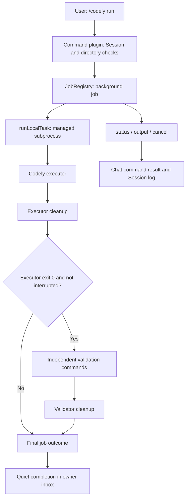

# MGSD L1：本机 DSH 实现总结

[English](MGSD_L1_Local_DSH_Implementation_Summary.md) | 中文

## 概述

L1 让用户从 DSH 启动本机 Codely 任务、查看输出、取消任务，并通过单独配置的检查验收结果。Codely 负责代码工作，DSH 负责执行管理、进程清理、任务状态和结果展示。L1 验收已完成；本地任务持久化及确定性 MGSD 工作流将在 L2 继续实现。本文是截至 2026-10-07 的实现参考，汇总当前方案及实际验证的限制。[实施 checklist](MGSD_Implementation_Checklist.zh.md) 管理里程碑状态，[本地使用说明](user/guide/codely-local.zh.md) 管理配置和操作步骤。

## 目录

- [目标与交付范围](#scope)
- [职责与执行流程](#execution)
- [实现方案](#implementation)
- [配置](#configuration)
- [结果与验收规则](#outcomes)
- [验收覆盖](#acceptance)
- [实现文件](#files)
- [限制与 L2 衔接](#handoff)
- [开发备注：验证记录](#evidence)

## 目标与交付范围

本地优先计划从一台机器上可用、可验证的 Codely 集成开始。L1 完成该原型的验收，再进入更完整的 MGSD 任务工作流和远程派发。

| 已交付能力 | 用户可观察的结果 |
|---|---|
| 本地任务提交 | `/codely run <task>` 在会话所选工程目录启动后台任务，返回 job id。 |
| 进度查看 | `/codely status` 列出本会话的 Codely 任务；`/codely output <id>` 返回保留的输出，并提示较早输出已丢弃。 |
| 独立验收 | 执行器成功后，每条配置检查也必须成功，任务才能成为 `completed`。 |
| 取消与截止时间 | `/codely cancel <id>`、整体截止时间及插件卸载会停止托管工作，并等待清理。 |
| 会话访问与目录准入 | 会话只能控制自己的 Codely 任务；同一插件实例对同一真实目录只允许一个活动 Codely 任务。 |
| 浏览器操作 | 不需要先发生模型轮次，Chat 就能展示命令和结果；刷新后已展示的命令记录仍可见。 |
| 可重复验收 | 确定性生命周期检查、真实 Loader/进程检查、真实 Codely 冒烟及无密钥 Web/会话回放提供互补证据。 |

## 职责与执行流程

Codely 拥有自己的 coding agent（编程智能体）循环。DSH 使用现有人工命令、Jobs 和 Subprocess 服务，将该循环作为外部工作运行。集成通过可选 Cordis 覆盖层加载，不需要修改 DSH 的 agent loop（智能体循环）。

| 参与方 | 职责 |
|---|---|
| 用户 | 选择本地工程、提交任务、配置可信验收命令并查看结果。 |
| Codely | 使用自己的模型和工具执行提示词、修改所选工程。 |
| 本地命令插件 | 校验配置、按会话授权访问、执行目录准入并创建/取消任务。 |
| DSH Jobs 与 Subprocess | 保留有界输出及任务状态、启动托管进程，并处理取消和清理。 |
| 独立检查 | 通过与 Codely 进程分开执行的命令判断验收结果。 |
| DSH Chat 与会话日志 | 展示命令结果，通过既有会话事件机制持久化命令调用和结果。 |

`/codely` 执行及任务完成不会开启 DSH 模型轮次。每个任务请求静默通知，完成通知保留在所属会话的待处理收件箱。普通聊天仍使用所选 DSH 模型，并可能消费待处理通知。真实 Codely 执行会调用 Codely 自己的模型；DSH 模型调用数为零不代表没有模型运行。

## 实现方案

实现复用 DSH 现有服务，保持本地适配器简洁。包 README 及下方源码文件定义具体服务 API。

### 命令插件与工程归属

覆盖层加载 `plugin.mjs`，其依赖 `commands`、`jobs` 和 `subprocess`。插件激活会拒绝缺失或空的可执行命令配置、空检查列表、argv 中的 NUL 字节、以 `.cmd`、`.bat` 或 `.ps1` 结尾的 shell 包装入口，以及无效数值限制。Windows 上通过 `node.exe` 加已安装的 JavaScript 入口启动 Codely。

插件从 `agent.session.header.cwd` 读取工程位置，要求它是现有绝对目录。插件解析真实路径，并在 Windows 上使用大小写归一化的键，拒绝同目录的第二个活动任务。任务携带当前会话归属，status/output/cancel 仅选择该会话的 Codely 任务。准入映射只存在于一个插件实例内，不是跨进程锁。

### 执行器、验收与清理

`run.mjs` 直接将可执行 argv 传给 `ctx.subprocess.spawn`，不隐式经过 shell 解析。Codely 接收 `--no-upm`、`--approval-mode=auto_edit`、`--path-policy=strict`、`--output-format=stream-json`，以及一个完整的 `--prompt=<task>` 参数。这能保留 Unicode 和多行提示词，不需要经过 shell 包装入口。

同一个取消信号及截止时间覆盖执行器和所有验收命令。运行器将 stdout/stderr 收集到有界缓冲区，定期写入任务输出，记录实际退出码和信号，并在每个进程结束时终止及等待托管进程范围。运行器先读取可用输出，再写入退出记录，使记录排在对应输出之后。

执行器清理成功后，运行器先检查中断，再开始验收。检查依次执行，首个失败或中断会停止后续检查。取消或截止时间若发生于最后一个验收进程的清理期间，也不能产生成功结果。清理失败会产生 `failed`，即使同时发生取消或超时。插件卸载会中止自身活动任务，并等待运行器结束。

### 静默完成通知与 Chat 展示

`JobSpec` 和已结算的 `JobEvent` 支持可选 `completionDelivery: 'quiet'`。`jobs-local` 将该要求传到结算事件；`tool-jobs` 仍将完成通知排入队列，但不会因该任务唤醒空闲所属会话。其他任务生产方继续使用控制器配置的通知行为。因此，即使所选预设会唤醒其他后台任务的所属会话，Codely 完成通知仍保持静默。

Chat 快照构建器在过滤后的快照存在可见记录时激活对话。因此，仅有命令的对话在模型轮次发生前也能展示结果；只有隐藏权限命令时仍不会激活 Chat。浏览器场景检查已记录的 Codely 命令在刷新后保持可见。

## 配置

[本地使用说明](user/guide/codely-local.zh.md#configure) 提供已验证的配置及 Web 启动入口。覆盖层从环境变量读取 JSON argv 数组，数值限制则由 Cordis 插件配置字段提供。

| 配置项 | 含义 | 默认值或要求 |
|---|---|---|
| `DSH_CODELY_COMMAND` → `command` | Codely 的可执行程序及启动参数。 | 必填，非空 JSON argv 数组。 |
| `DSH_CODELY_CHECKS` → `checks` | 独立执行的验收命令。 | 必填，至少包含一个非空 argv 数组的 JSON 数组。 |
| `timeoutMs` | 执行器及检查的整体截止时间。 | `900000` 毫秒（15 分钟）。 |
| `graceMs` | 传给托管子进程提供方的宽限时间。 | `3000` 毫秒。 |
| `maxBytes` | 分别传给 stdout 和 stderr 的收集上限。 | 每个输出流 `65536` 字节。 |
| `pollMs` | 将进程输出写入任务的轮询间隔。 | `100` 毫秒。 |

数值字段必须是大于零且不超过 `2147483647` 的安全整数。检查与执行器使用相同的工程 cwd。coding agent 可以重写的检查脚本，不构成验收标准的独立证据；应配置实现或预期结果保持可信的检查。

## 结果与验收规则

任务在清理后报告进程结果。详情及保留的输出区分执行器失败、验收失败、中断和清理失败。

| 条件 | 最终状态 | 验收含义 |
|---|---|---|
| Codely 退出 0、所有检查退出 0、清理成功，且没有中断。 | `completed` | 配置的可执行检查通过；这本身不能证明语义正确。 |
| Codely 退出非零。 | `failed` | 不执行验收。 |
| 某条检查退出非零。 | `failed` | 报告其序号、退出码及信号；不执行后续检查。 |
| 取消或截止时间中断执行/检查，且清理成功。 | `killed` | 详情标识 `Cancelled` 或 `Timed out`；验收不获认证。 |
| 进程启动/执行或托管清理失败。 | `failed` | 即使同时发生取消或超时，失败仍然可见。 |

实际退出事实保留在输出中，与截止时间/取消结果分别报告。例如，观察到退出码 0，不能覆盖清理期间到达的中断。取消命令只是请求取消；应通过 status/output 查看结算后的结果。

## 验收覆盖

L1 验收将命令行为与真实进程、浏览器展示、可重复的录制结果关联起来。各类检查覆盖不同失败模式，不能互相替代。

| 验收关注点 | 实现及验证 |
|---|---|
| 执行器与检查共同决定成功。 | 运行器测试覆盖执行器失败，以及执行器退出 0 后检查退出 23；Loader 和 Web 场景也实际观察验收失败。 |
| 中断不能产生成功。 | 同步屏障控制的生命周期测试覆盖执行器及最后一个验收进程清理期间的取消/截止时间、启动前中断，以及清理返回 false/拒绝的情况。 |
| 托管工作已停止。 | 真实 Windows 提供方的 Loader 场景在取消/卸载后观察到父子进程均不存在。 |
| 会话和目录控制有效。 | Loader 场景拒绝跨会话访问及同一真实目录的第二个任务，并确认源配置未变。 |
| Codely 完成通知保持静默。 | 每任务静默通知回归，以及 Web 模型调用探针/空调用记录，覆盖使用唤醒通知的预设。 |
| 浏览器命令无需模型聊天即可工作。 | 构建后的 Web 与页内目录选择器覆盖 run/status/output/cancel、成功、检查退出 23、取消及刷新。 |
| 录制结果可重复。 | Web 场景执行十条已记录命令，对比归一化会话事件及 Chat 展示，检查完整预期工作区，并注册到快照语料中。 |
| 已安装执行器真实可用。 | 已登录的真实 Codely 冒烟修改临时工程；单独执行的可信文件内容检查验证结果。 |

## 实现文件

继续开发或定位失败时，应从这些归属文件开始。本文不替代具体代码或包文档。

| 范围 | 归属文件 |
|---|---|
| 本地组合与命令 | [覆盖层](../apps/cli/config/examples/codely-local/cordis.patch.yml)、[插件](../apps/cli/config/examples/codely-local/plugin.mjs)、[运行器](../apps/cli/config/examples/codely-local/run.mjs)。 |
| 任务通知 | [Job 类型](../packages/jobs/jobs/src/types.ts)、[本地注册表](../packages/jobs/jobs-local/src/index.ts)、[完成通知消费方](../packages/jobs/tool-jobs/src/index.ts)、[Jobs 子系统](subsystems/jobs.zh.md)。 |
| 仅命令 Chat | [快照构建器](../packages/client/ui-chat/src/client/conversation-nodes/chat-snapshot-builder.ts)、[回归测试](../packages/client/ui-chat/tests/conversation-node-definitions.client.spec.ts)。 |
| 生命周期及真实进程验收 | [Vitest 入口](../apps/cli/tests/codely-local.spec.ts)、[运行器测试](../apps/cli/tests/fixtures/codely-local/run.test.mjs)、[Loader 驱动](../apps/cli/tests/fixtures/codely-local/driver.ts)、[真实冒烟](../apps/cli/tests/fixtures/codely-local/live.ts)。 |
| Web 与录制验收 | [Web 场景](../apps/web/tests/codely-local.snapshot.ts)、[场景文件](../snapshots/web/codely-local/)、[快照语料归属注册](../scripts/session-snapshot-corpus.corpus.ts)。 |
| 构建/测试程序归属 | [Host 配置](../tsconfig.host.json)、[Web 配置](../apps/web/tsconfig.json)；Web 快照归属于 Host 测试程序。 |
| 配置及里程碑衔接 | [本地使用说明](user/guide/codely-local.zh.md)、[实施 checklist](MGSD_Implementation_Checklist.zh.md)。 |

## 限制与 L2 衔接

任务、活动目录准入及原始进程输出仍属于当前运行进程。重启 DSH 不会恢复正在运行的 Codely 任务。持久化会话日志保留命令调用和已展示结果，但不是持久 MGSD TaskStore，也不是每个原始输出分片的完整审计。输出仍为原始 stream JSON，没有专门的 Codely 工具卡片。

Codely 的 strict 路径策略和 DSH 进程清理不提供文件系统或网络隔离。所选子进程提供方的进程控制限制仍然适用。L1 没有实现交互审批、执行器续接、跨进程目录归属、自动创建每任务 worktree、执行 envelope 强制校验或远程派发。

下一步进入 [checklist 的 L2](MGSD_Implementation_Checklist.zh.md#next-local-checklist)：不可变任务请求、带品牌类型的任务标识、持久任务状态、明确合法转换、审批约束、中断/重启恢复，以及有上限的评审/修复循环。工作流 Core 保持不依赖 DSH/Cordis，复用当前集成作为 DSH 执行适配器。GitHub 远程派发仍在本地工作流里程碑之后作为第二阶段开展。

## 开发备注：验证记录

本节是有日期的测试证据，不承诺更广泛的平台支持。L1 证据于 2026-10-06/07 在 Windows、Node.js v26.10.0 上收集。本次编写总结复用已记录结果，没有重跑付费模型推理。具体操作/测试命令及历史证据仍保留在[本地使用说明](user/guide/codely-local.zh.md#verification)。

| 检查 | 实际结果 |
|---|---|
| 聚焦 CLI、`tool-jobs` 和 `jobs-local` 测试 | 三个 Vitest 文件、147 个测试通过；CLI 入口包含 13 个嵌套 Node 生命周期测试及两个 Loader 场景。 |
| 已登录的真实 Codely 冒烟 | `completed`；独立内容检查通过；DSH 模型调用次数为 `0`。 |
| 构建后的 Web 场景及无密钥语料回放 | 两个文件、四个测试通过；由于 bundled Chromium 不可用，选择了本机安装的 Edge。 |
| 构建与静态检查 | 完整构建通过；Host 构建和修正后的 `lint:contracts-ready` 通过；七组已修改双语配对及 `git diff --check` 通过。 |
| 快速文档检查 | `test:docs`：19 通过、1 失败，原因是 MGSD 架构计划缺少中文配对。 |
| 完整文档检查 | `doc-sync`：39 通过、3 失败，分别为计划缺少配对、该计划的 TypeScript 示例无法编译，以及 Cordis API catalog 陈旧。 |
| L1 提交钩子 | 暂存 lint、翻译配对、空白字符、第三方声明及 vendor manifest 防护通过。 |

文档/catalog 剩余失败与 L1 功能验收分别记录，不能据此宣称全仓通过。已提交的 L1 实现及录制验证证据支持继续开展 L2 本地工作流。
